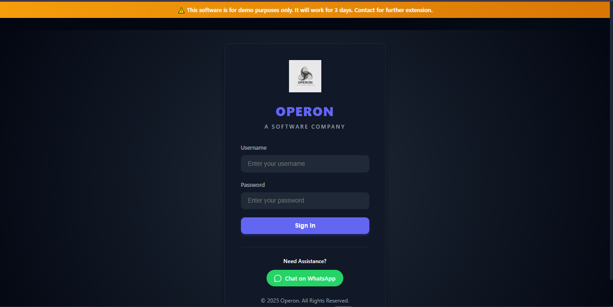
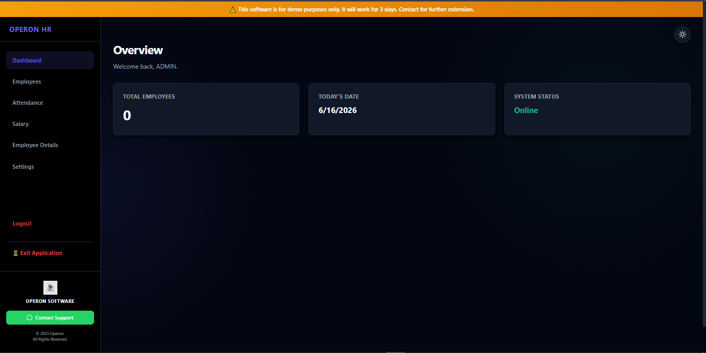
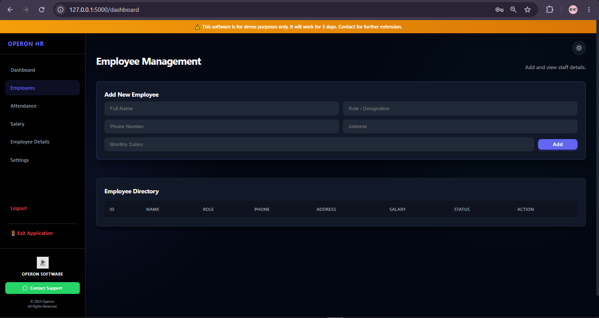
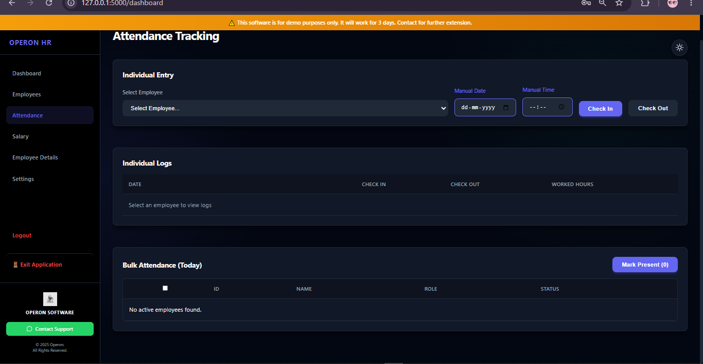
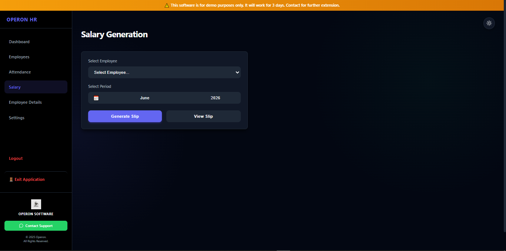
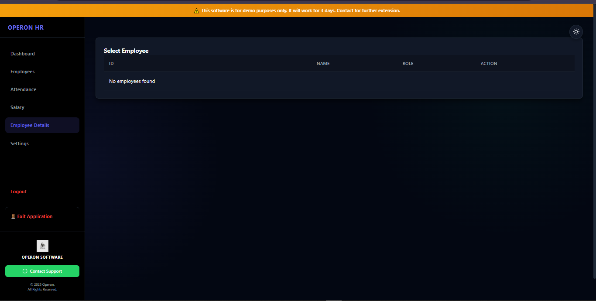
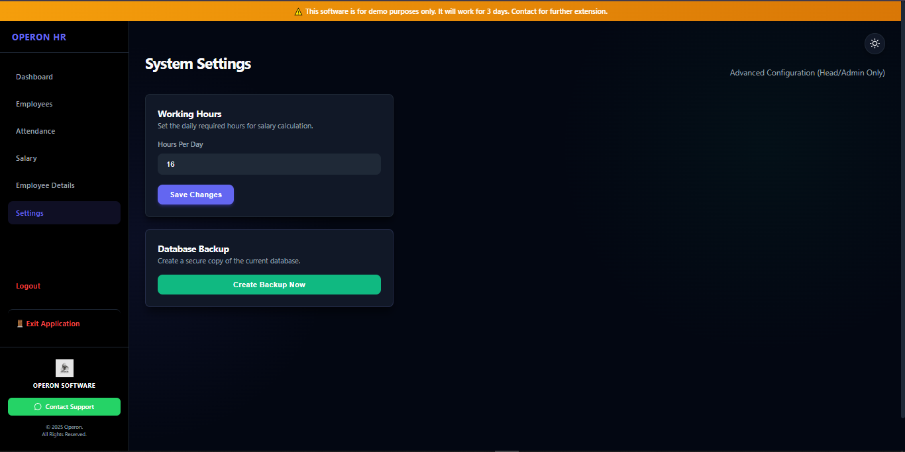
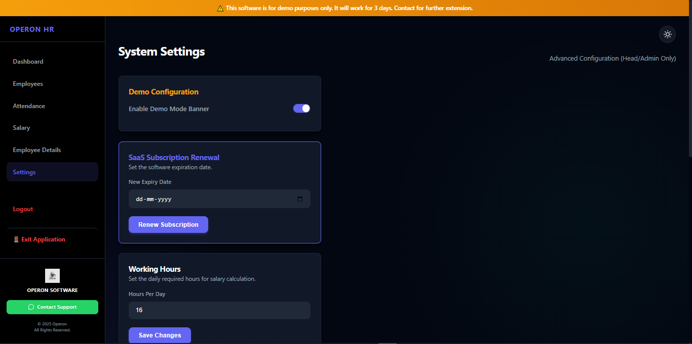
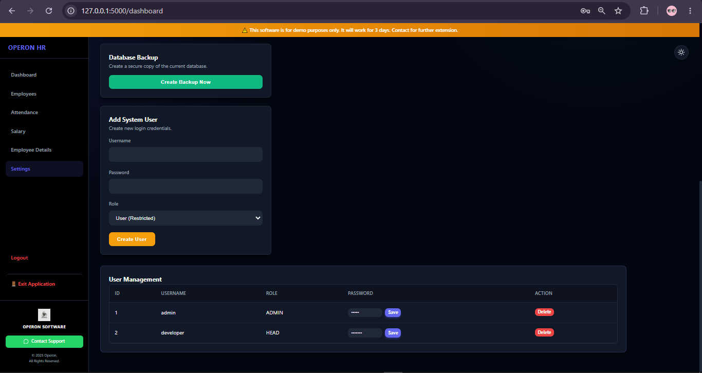

# 👨‍💼 Employee Attendance & Payroll Management System

A full-stack Employee Attendance & Payroll Management System built using Flask and SQLite.

The application allows organizations to manage employees, track attendance, generate salary slips, manage system users, and maintain secure employee records through a centralized dashboard.

---

## 🚀 Features

* Secure multi-user authentication
* Employee record management
* Individual attendance tracking
* Bulk attendance marking
* Automated payroll generation
* Salary slip generation
* User role management
* Database backup system
* Employee document storage
* SaaS-style subscription expiry simulation
* Encrypted sensitive data storage
* Modern dark-themed dashboard interface

---

## 🛠️ Tech Stack

### Backend

* Python
* Flask

### Database

* SQLite3

### Frontend

* HTML
* CSS
* JavaScript

### Security

* Cryptography (Fernet Encryption)

---

## 🏗️ System Architecture

The project follows a modular architecture to maintain separation of concerns and improve maintainability.

### Structure

* `routes/` → Application routes and request handling
* `services/` → Business logic layer
* `database/` → Database operations
* `utils/` → Utility and helper functions
* `static/` → CSS, JavaScript, images
* `templates/` → Frontend templates

### Core Components

* Authentication System
* Employee Management Module
* Attendance Tracking Module
* Payroll Generation Engine
* User Management System
* Database Backup Utility
* Settings & Configuration Module

---

## 🔐 Security Features

* Password encryption before storage
* Credential validation during login
* Sensitive data protection using Fernet encryption
* Role-based user access control
* Restricted administrative settings

---

## 📸 Screenshots

### Login System



### Dashboard Overview



### Employee Management



### Attendance Tracking



### Payroll Generation



### Employee Details



### Administrator Settings



### Dark Mode Support


### Developer Dashboard (Full Control)



### Developer Dashboard (Advanced Controls)



---

## ⚙️ Installation

```bash
git clone https://github.com/simarCoder/employee-attendance-system.git

cd employee-attendance-system

pip install -r requirements.txt

python -m backend.app
```

Open your browser and visit:

```text
http://127.0.0.1:5000
```

---

## 📋 Functional Modules

### Employee Management

* Add employees
* Update employee records
* Delete employees
* Maintain employee directory

### Attendance System

* Individual attendance entries
* Bulk attendance marking
* Attendance log tracking
* Working hours calculation

### Payroll System

* Monthly salary calculation
* Attendance-based payroll generation
* Salary slip generation
* Payroll record management

### User Management

* Create users
* Assign roles
* Manage access permissions
* Administrative controls

### System Administration

* Working hours configuration
* Database backup creation
* Demo mode management
* Subscription expiry management

---

## 🎯 Project Purpose

This project was developed to simulate a real-world employee management and payroll workflow commonly used in small businesses and organizations.

The primary goal was to strengthen practical skills in:

* Backend development
* Database design
* Authentication systems
* Data security
* Business workflow implementation
* Full-stack application architecture

---

## 🚧 Future Improvements

* Cloud deployment
* Email notifications
* Employee self-service portal
* Advanced reporting & analytics
* REST API integration
* Audit logging system
* Docker containerization

---

## 👨‍💻 Author

**Simar**

GitHub: https://github.com/simarCoder

---

## ⭐ Support

If you found this project useful, consider giving it a star on GitHub.
