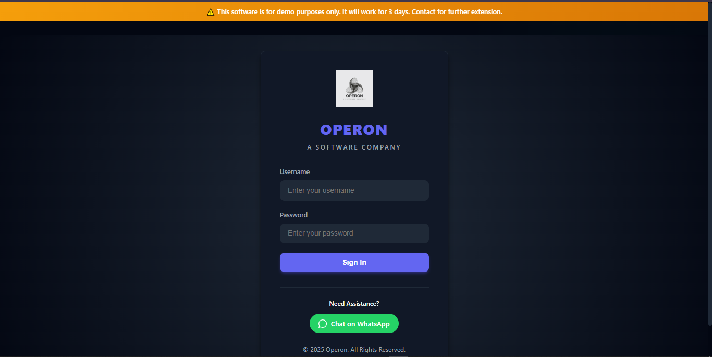
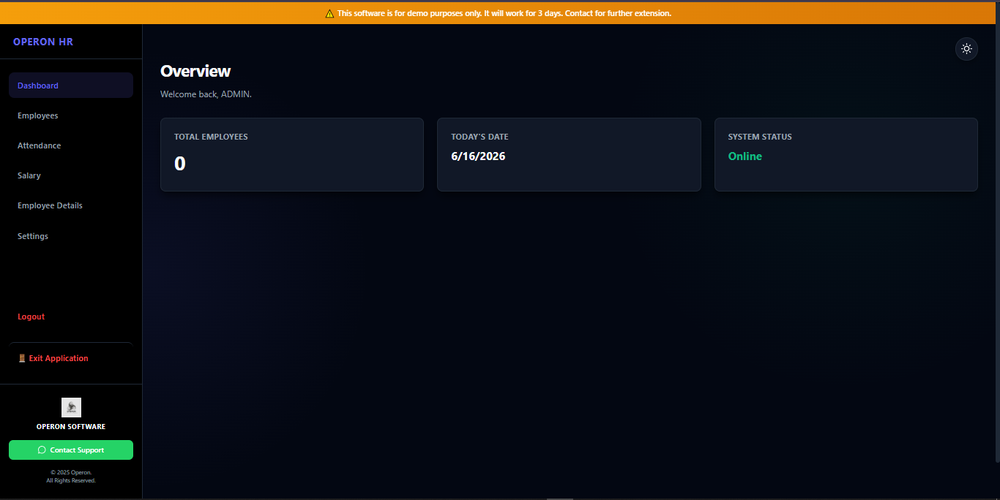
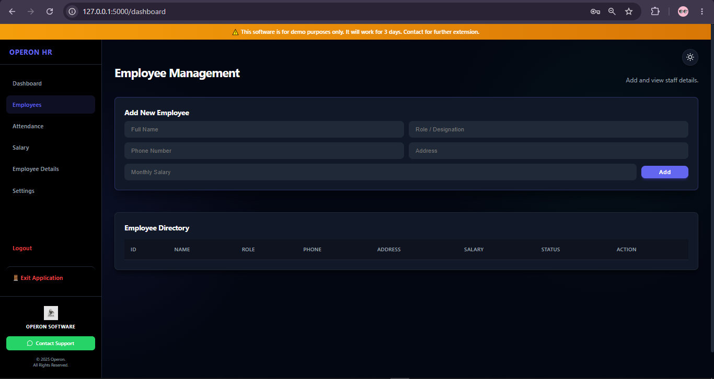
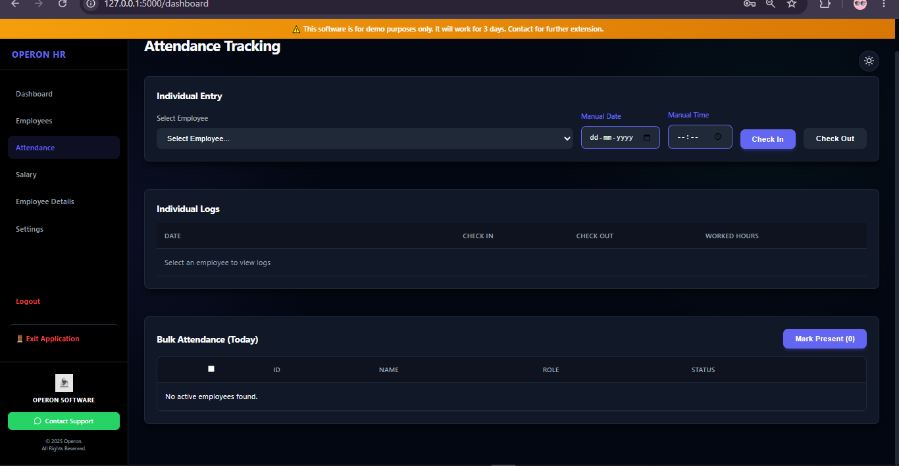
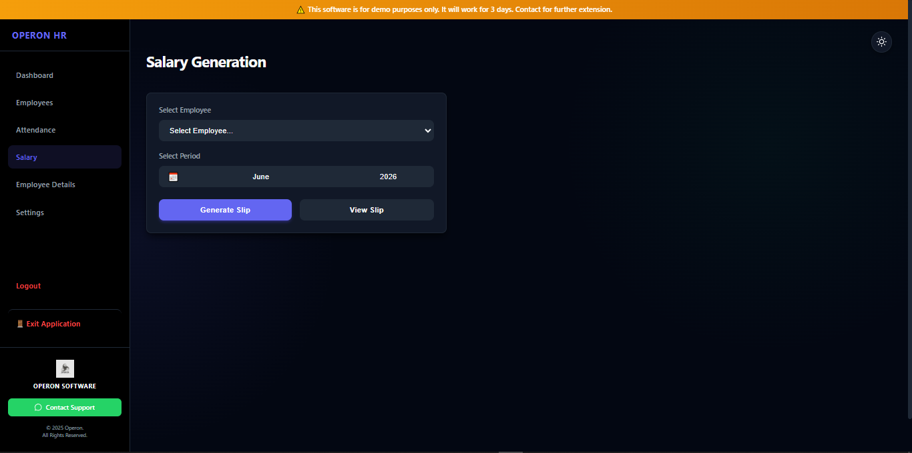
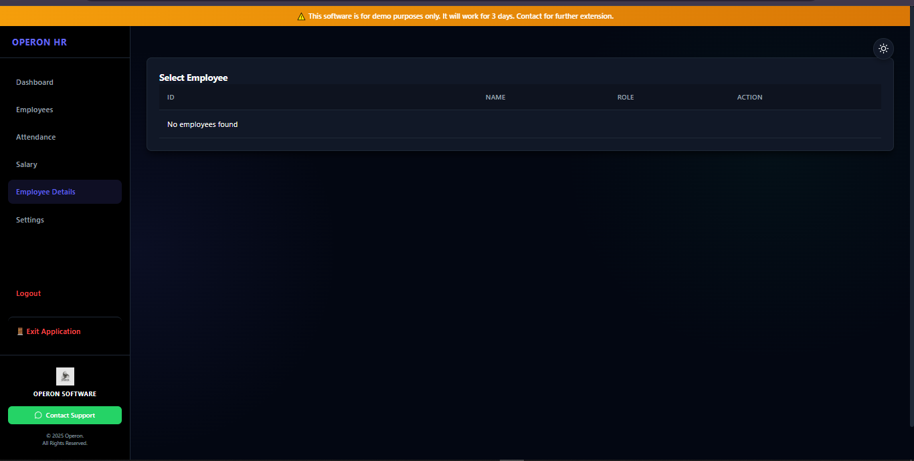
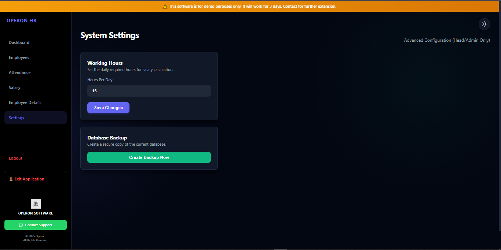
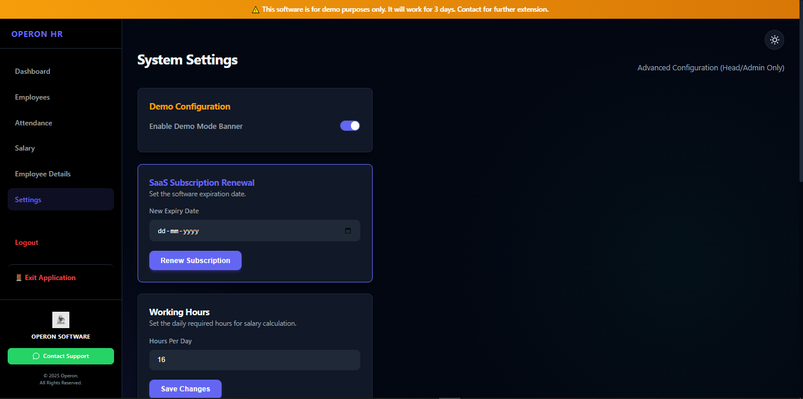
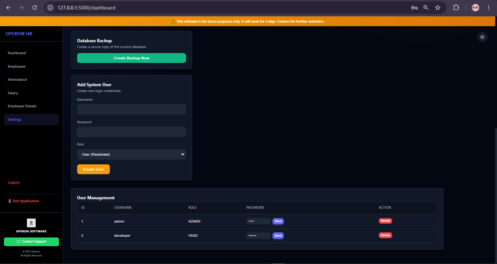

# Employee Attendance & Payroll Management System

A local-first human resources application for employee records, attendance, and payroll. It runs as a Flask and SQLite web application during development and can be packaged as a Windows desktop application using PyWebView and PyInstaller.

## Features

### Employee management

- Create, edit, activate, deactivate, and manage employee records.
- Configure employee roles, salary type and assigned pay, work schedules, grace leave allowance, and attendance rules.
- View employee profiles, attendance summaries, salary history, and uploaded documents.
- Search employee directories and records by name, ID, role, status, and other visible details.

### Attendance

- Record individual check-ins and check-outs, including administrator-entered date and time.
- Mark attendance for multiple employees at once.
- Import and map punches from Secureye biometric devices.
- View attendance by day, month, or year, and view an employee’s records one month at a time.
- Search attendance lists. Dates display as `DD-MM-YYYY`; punch times use a 12-hour clock.

### Payroll

- Generate a salary statement for an employee or a monthly payroll register for all active employees.
- Review month-by-month generated salary records and their calculation details.
- Download individual statements or the full register as PDF.
- Payroll uses the employee’s assigned base salary. Scheduled days with recorded work count as worked days; scheduled days with no recorded work count as absences. Grace allowance is applied before charged leave and leave deductions are calculated. Overtime is shown for reference and does not increase net pay under the current rules.

### Administration and records

- Manage system users and role-based permissions (`head`, `admin`, and `user`).
- Configure working hours, Secureye connection settings, demo mode, and subscription expiry.
- Create SQLite database backups and review audit events.
- Upload and manage employee documents.
- Display the current software version in the application window.

### Windows desktop app and updates

- Package the application as a Windows executable with PyWebView and PyInstaller.
- At startup, packaged builds check the latest public GitHub release for a newer version.
- Users choose whether to install an update. The downloaded package is checked against its SHA-256 digest before installation.
- A separate updater helper replaces the executable after the application closes and retains the previous executable files in `old_files`.

See [UPDATER.md](UPDATER.md) for release and installation instructions.

## Screenshots

### Login



### Dashboard



### Employee directory



### Attendance



### Payroll



### Employee profile



### Administration



### Theme options


### Developer controls





## Technology

- **Backend:** Python, Flask
- **Database:** SQLite
- **Frontend:** HTML, CSS, JavaScript
- **Desktop packaging:** PyWebView, PyInstaller
- **PDF generation:** ReportLab
- **Encryption:** Fernet via the `cryptography` package
- **Release automation:** GitHub Actions

## Project structure

```text
backend/
  app.py                 Flask routes and application setup
  database.py            SQLite connection and schema setup
  services/              Attendance, payroll, employee, settings, and document logic
  devices/               Secureye device communication
  utils/                 Security helpers
static/                  CSS, JavaScript, and image assets
templates/               Login and dashboard HTML templates
launcher.py              Starts Flask and the PyWebView desktop window
updater.py               Release checks, update dialog, and download staging
updater_helper.py        Replaces the running Windows executable
HR_Management_System.spec PyInstaller build configuration
app_version.py           Desktop application version
.github/workflows/       Windows release build and publishing workflow
```

Runtime data is stored alongside the application: the SQLite database in `db/`, uploaded employee files in `UPLOADS/`, and database backups in `BACKUPS/`. Keep these folders when replacing or reinstalling the application.

## Run from source

Python 3.12 is used by the automated Windows release workflow. From the repository directory, install the dependencies and start Flask:

```bash
python -m pip install -r requirements.txt
python -m backend.app
```

Open [http://127.0.0.1:5000](http://127.0.0.1:5000) in a browser.

## Build the Windows desktop application

On Windows, install the project dependencies and run the PyInstaller spec:

```powershell
python -m pip install -r requirements.txt
python -m PyInstaller --clean --noconfirm HR_Management_System.spec
```

The build produces `dist/HR_Management_System.exe` and `dist/HR_Management_System_Updater.exe`. Distribute both files together; the updater executable must be beside the main application executable.

## Publish a release

The GitHub Actions workflow builds and publishes a Windows release when a version tag is pushed. The tag must match `APP_VERSION` in `app_version.py`.

For example, after changing `APP_VERSION` to `1.3.1` and committing that change:

```bash
git tag v1.3.1
git push origin v1.3.1
```

The workflow creates a GitHub Release containing `HR_Management_System-win64.zip`. Installed desktop builds check that release on startup. Detailed steps and installation notes are in [UPDATER.md](UPDATER.md).

## Maintainer

**Simar** · [GitHub](https://github.com/simarCoder)

## Support

If you find the project useful, consider starring the repository on GitHub.
